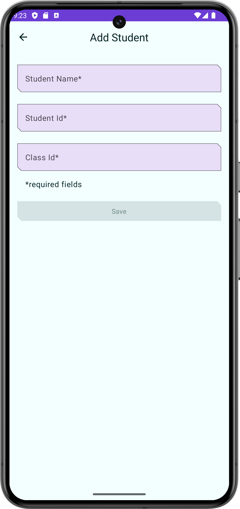
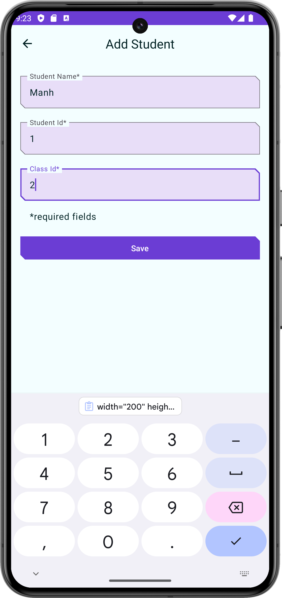
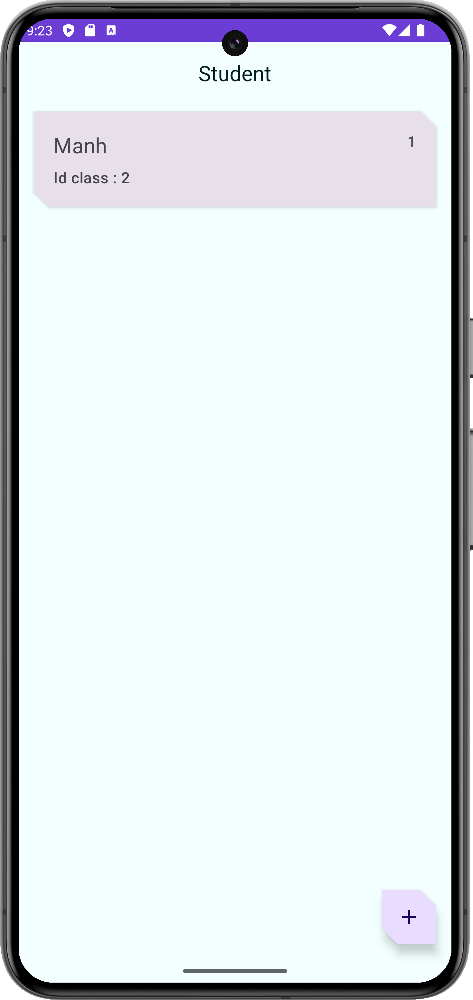

# Hệ Thống Quản Lý Sinh Viên

## Giới Thiệu Dự Án
Dự án này là một hệ thống quản lý sinh viên, giúp tối ưu hóa và cải thiện hiệu quả hoạt động của nhà trường. Ứng dụng cho phép quản lý hồ sơ và học phí của sinh viên.

## Thành Viên Nhóm:

Lưu Bảo Phúc : Phát triển phần mềm.

Hoàng Đức Mạnh : Phát triển phần mềm.

## Chức Năng Chính: 

Thêm hồ sơ sinh viên.

Xóa hồ sơ sinh viên.

Cập nhật hồ sơ sinh viên lên cơ sở dữ liệu.

## UML Dự Án

### 1.1 UML Component Diagram

### 1.2 UML Sequence Diagram

#### Hiển thị sinh viên

#### Sửa thông tin sinh viên

#### Xóa sinh viên

## Giao diện của dự án

    
    
    
    

